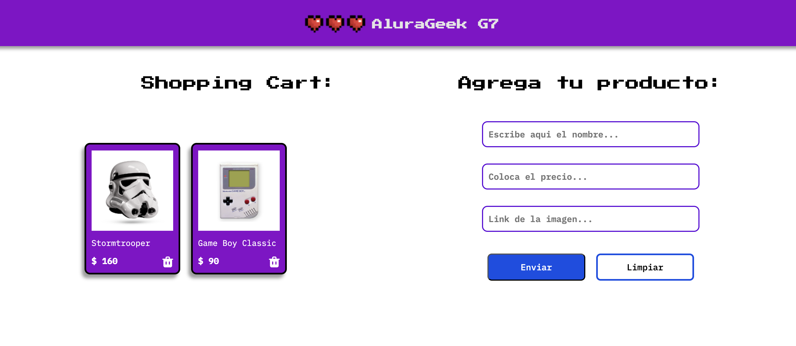

# Alura Geek: Tienda Online

Este proyecto es parte del **Challenge Oracle ONE - Alura**, donde desarrollamos una tienda en línea para productos geek. Aquí podrás explorar, agregar productos al carrito y gestionar tu inventario como administrador.

---
### Página Principal

## 🚀 Descripción del Proyecto

**Alura Geek** es una aplicación web diseñada para:
- Navegar por un catálogo de productos geek y tecnológicos.
- Agregar productos al carrito de compras.
- Simular la funcionalidad de agregar y eliminar productos desde el backend (API fake con `json-server`).

Este proyecto tiene como objetivo poner en práctica habilidades en **HTML**, **CSS**, **JavaScript** y **consumo de APIs**.

---

## 📂 Estructura del Proyecto

- **`/db`**: Contiene la base de datos simulada (`db.json`) para almacenar los productos.
- **`/css`**: Hojas de estilos para el diseño del sitio.
- **`/img`**: Imágenes utilizadas en el proyecto.
- **`/js`**: Archivos JavaScript que gestionan la lógica del frontend.

---

